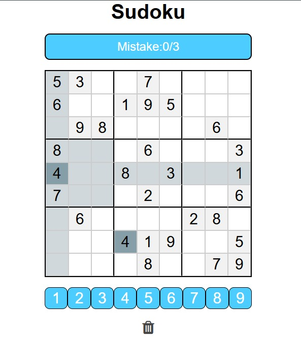

# SudokuSolver_Project

A web-based Sudoku game built using **HTML**, **CSS**, and **JavaScript**. This project allows users to play Sudoku in the browser with interactive features like real-time mistake tracking and win/loss detection.

## 🔍 Features

- ✅ 9x9 Sudoku puzzle board
- ✅ Click to select and fill in numbers
- ✅ Mistake counter with a limit of 3 errors
- ✅ Automatically detects puzzle completion
- ✅ Highlights selected row, column, grid, and same digits
- ✅ Option to delete entries (not for pre-filled    cells)

## 📸 Preview
 
> 

### 📂 Project Structure:

/SudokuSolver-project
├── index.html
├── style.css
├── script.js
├── README.md
└── screenshot.jpg 

## 🧠 Technologies Used

- HTML
- CSS
- JavaScript 

## ✍️ Author

**Kumari Divya Rashmi**

## 💡 Future Improvements

- Difficulty levels (easy/medium/hard)
- Timer
- Sound effects
- Dark mode